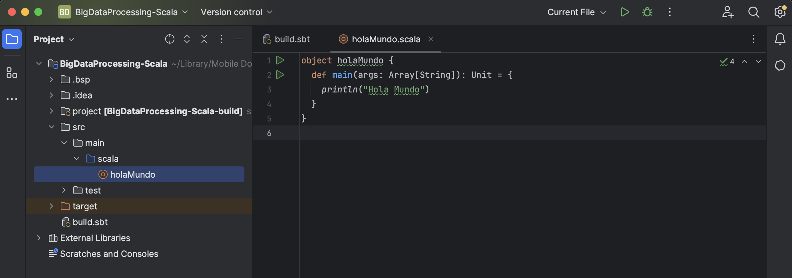

# Fundamentos de Scala: Una Introducción al Lenguaje de Programación Versátil

Scala es un lenguaje de programación versátil que combina **programación funcional** con un sistema de **tipos estáticos**. Aquí hablaremos de los fundamentos de [Scala](https://www.scala-lang.org/), desde sus características esenciales hasta las diferencias clave con Java. También abordaremos cómo crear un proyecto Scala en [IntelliJ](https://www.jetbrains.com/es-es/idea/), algunas de las herramientas útiles y conceptos básicos, como las variables `var` y `val`, listas y proporcionaremos ejemplos para ayudarte a comprender mejor este emocionante lenguaje.

## Scala desde Cero

Scala es un lenguaje de programación de uso general que combina **programación funcional** y una **sólida tipificación estática**. Una de las ventajas clave de Scala es que su código fuente se compila en *bytecode* de Java, lo que significa que los programas escritos en Scala pueden ejecutarse en la **Máquina Virtual de Java (JVM)**. Esto proporciona una amplia compatibilidad y una amplia gama de bibliotecas Java para su uso.

### Principales Características de Scala

1. **Orientación a Objetos**: Scala es un excelente ejemplo de un lenguaje orientado a objetos. Utiliza clases y traits (interfaces) para modelar objetos y abstracciones de datos.

2. **Programación Funcional**: La programación funcional trata las funciones como ciudadanos de primera clase en el lenguaje. Scala permite definir funciones anónimas (sin nombre) de manera sencilla y admite funciones de orden superior que permiten crear funciones anidadas.

### Diferencias Clave entre Java y Scala

- Scala es *más conciso* que Java, lo que significa que puedes lograr más con menos líneas de código.
- Scala admite la *inmutabilidad*, lo que significa que puedes declarar variables como `val` (valores) que no pueden cambiar, lo que es útil para garantizar la integridad de los datos.
- Scala utiliza una *sintaxis más expresiva y poderosa* que Java, lo que facilita la escritura de *código limpio y mantenible*.
- Scala es *compatible con programación funcional*, lo que abre nuevas posibilidades para escribir *código más claro y eficiente*.

### Recursos Útiles

- Puedes encontrar más información sobre Scala en la [documentación oficial de Scala](https://docs.scala-lang.org/).

- Si deseas una referencia rápida de Scala, consulta la [Scala Cheatsheet](https://docs.scala-lang.org/cheatsheets/index.html).

- Si deseas probar Scala directamente en tu navegador, visita [Scastie](https://scastie.scala-lang.org/), un entorno de programación en línea para Scala.

- Para comenzar a programar en Scala, descarga el [compilador y las herramientas de Scala](https://www.scala-lang.org/download/).

- [Tutorial de Scala](https://tutoriales.edu.lat/pub/scala?alias=tutorial-de-scala)

## Creación de un Proyecto Scala en IntelliJ

Si estás familiarizado con Java y has trabajado con IntelliJ, crear un proyecto Scala es bastante similar. Sigue estos pasos:

1. Abre IntelliJ IDEA y selecciona "File" (Archivo) en la parte superior izquierda.

2. Elige "New" (Nuevo) y selecciona "Project" (Proyecto).

3. Asegúrate de seleccionar "Scala" en la lista de tecnologías disponibles.


4. Configura el proyecto con un nombre y una ubicación.

5. IntelliJ generará una estructura de directorios estándar para tu proyecto Scala, que incluirá carpetas como "src" (fuente) y "out" (salida).



## Consola de Scala

Scala proporciona una consola interactiva que te permite ejecutar fragmentos de código Scala en tiempo real. Puedes acceder a la consola de Scala simplemente escribiendo `scala` en la línea de comandos.

## `var` vs. `val` en Scala

En Scala, puedes declarar variables usando `var` o `val`. La diferencia clave es que las variables declaradas con `val` son *inmutables*, lo que significa que no pueden cambiar una vez que se les asigna un valor, mientras que las variables declaradas con `var` pueden cambiar.

```scala
val nombre = "Juan"  // Una variable inmutable
var edad = 30        // Una variable mutable
```

## Listas en Scala

Scala ofrece una rica API para trabajar con listas. Puedes crear y manipular listas de manera eficiente. Aquí hay un ejemplo simple:

```scala
val numeros = List(1, 2, 3, 4, 5)
val numerosDobles = numeros.map(_ * 2)  // Duplicar cada número
```

## Ejemplos de Scala

A continuación, te proporcionamos un ejemplo de código Scala que muestra cómo definir una función y llamarla:

```scala
object EjemploScala {
  def saludar(nombre: String): String = {
    s"Hola, $nombre"
  }

  def main(args: Array[String]): Unit = {
    val mensaje = saludar("Juan")
    println(mensaje)
  }
}
```

Este programa define una función llamada `saludar` que toma un nombre como argumento y devuelve un saludo personalizado. Luego, en el método `main`, llamamos a esta función y mostramos el resultado en la consola.

**Scala** es un lenguaje poderoso que *combina las mejores características de la programación orientada a objetos y funcional*. A medida que te sumerges en Scala, descubrirás su elegancia y expresividad, lo que lo convierte en una herramienta valiosa para desarrolladores de todo tipo. ¡Explora y disfruta de la programación en Scala!